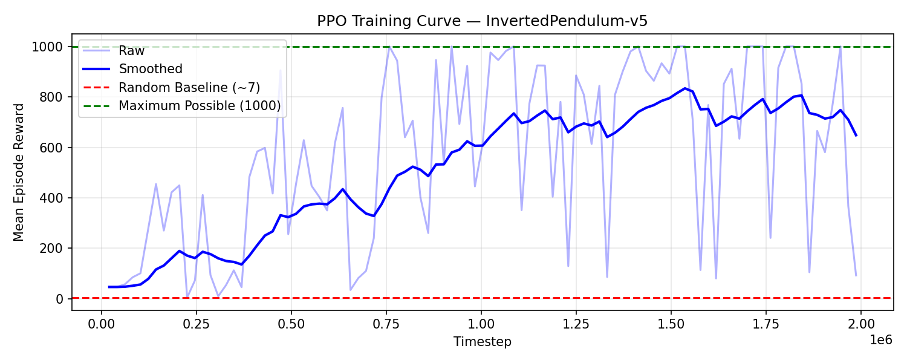

## Control of Inverted Pendulum Dynamics Through Reinforcement Learning 
This projects aims to train a reinforcement learning agent to balance a pendulum on a cart through 
proximal policy optimization (PPO) with an actor-critic architecture. The goal is to maximize the length of time that the pole remains balanced. Utilizes the Inverted Pendulum 
environment from the Gymnasium API, with future intent to train the agent on a physical version of 
this problem.

*Final project for COMPSCI372 at Duke University.*


### What It Does
Balancing an inverted pendulum on a cart is a classic control problem that can be solved using control
theory. The purpose of this project is to solve this problem by instead training an agent through reinforcement
learning. The agent follows a proximal policy optimization (PPO) algorithm and learns through updating an actor-critic
network while interacting with the Inverted Pendulum environment from Gymnasium API's MuJoCo physics engine. The agent receives a reward for each timestep that the pendulum remains balances, and the agent aims to maximize the total reward over an episode. This project implements an actor-critic network and a PPO algorithm that utilizes Generalized Advantage Estimation (GAE) to reduce variance, as well as training and evaluation methods. The trained agent achieves an average reward of 975.73/1000 per episode compared to an average baseline of 7.17/1000.

### Quick Start
See SETUP.md for full instructions.

1. Open and sign in to Google Colab (https://colab.research.google.com)
2. Mount Google Drive.
```python
from google.colab import drive
drive.mount('/content/drive')

import os
os.chdir('/content/drive/MyDrive/NEW_FOLDER_NAME')
```

3. Clone repository.
```bash
git clone https://github.com/victoriaf55/cs372-final.git
```

4. Install dependencies.
```bash
pip install -r cs372-final/requirements.txt
```

5. Train the agent.
```bash
python train.py
```

6. Evaluate trained agent.
```bash
python evaluate.py
```

### Video Links
- Project Demo: [videos/Project_Demo.mp4]
- Technical Walkthrough: [link]

### Evaluation
| Model | Mean Reward (max 1000) | Reward Std | Success Rate (% of episodes max reward is achieved) |
|---|---|---|---|
| Random Baseline | 7.17 | 4.78 | 0% |
| Trained Agent | 975.73 | 129.75 | 95.0% |



### Individual Contributions
Solo project completed by Victoria Feng.