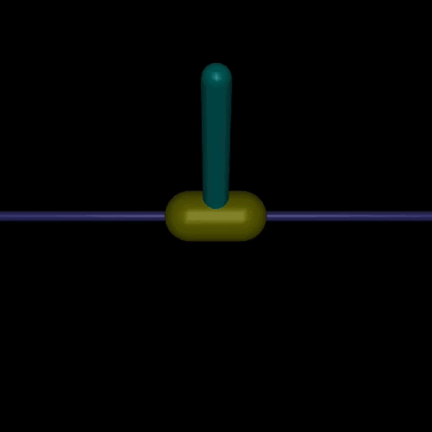

## Control of Inverted Pendulum Dynamics Through Reinforcement Learning 
This projects aims to train a proximal policy optimization agent to balance a pendulum on a cart through 
an actor-critic architecture. Utilizes the Inverted Pendulum environment from the Gymnasium API, with future 
intent to train the agent on a physical version of this problem.

*Final project for COMPSCI372 at Duke University.*

### What It Does
describes in one paragraph what your project does

### Quick Start
concisely explains how to run your project

### Video Links
direct links to your demo and technical walkthrough videos

### Evaluation
presents any quantitative results, accuracy metrics, or qualitative outcomes from testing